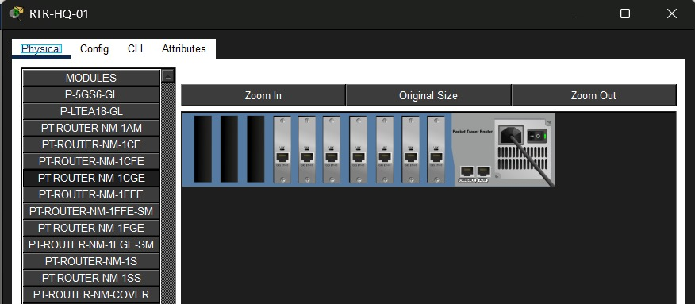
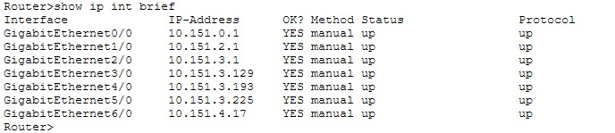
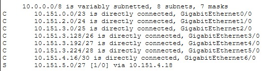
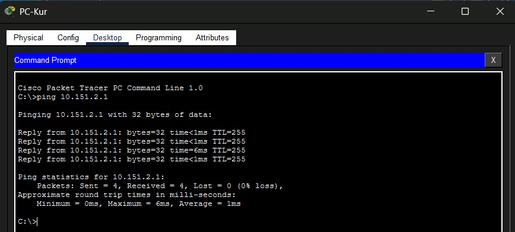

# Tugas1-Jarkom-Maritza-Adelia-111

## Membuat Topologi dengan CPT


Karena jaringan butuh banyak interface, tambah module PT-ROUTER-NM-1CGE
```
klik router -> physical -> matikan router -> tambahkan PT-ROUTER-NM-1CGE -> nyalakan router
```



di CLI HQ tambahkan IP Address:
```bash
enable
conf t
```

```bash
interface g0/0
 ip address 10.151.0.1 255.255.254.0
 no shut
exit

interface g1/0
 ip address 10.151.2.1 255.255.255.0
 no shut
exit

interface g2/0
 ip address 10.151.3.1 255.255.255.128
 no shut
exit

interface g3/0
 ip address 10.151.3.129 255.255.255.192
 no shut
exit

interface g4/0
 ip address 10.151.3.193 255.255.255.240
 no shut
exit

interface g5/0
 ip address 10.151.255.2 255.255.255.252
 no shut
exit
ip route 10.151.4.0 255.255.255.224 10.151.255.1
end

```

Di Branch:
```bash
conf t

interface g0/0
 ip address 10.151.4.1 255.255.255.224
 no shut
exit

interface g0/1
 ip address 10.151.255.1 255.255.255.252
 no shut
exit
ip route 0.0.0.0 0.0.0.0 10.151.255.2
end
```
Cek dengan:
```bash
show ip interface brief
```


Cek Prefix:


## Set PC 

Buka PC → Desktop Tab → IP Configuration

### PC-Sekre (Sekretariat - 380 host)


```bash
IP Address: 10.151.0.2
Subnet Mask: 255.255.254.0
Default Gateway: 10.151.0.1
```

### PC-Sekre (Sekretariat - 380 host)
```bash
IP Address: 10.151.0.2
Subnet Mask: 255.255.254.0
Default Gateway: 10.151.0.1
```
### PC-Kur (Bidang Kurikulum - 220 host)
```bash
IP Address: 10.151.2.2
Subnet Mask: 255.255.255.0
Default Gateway: 10.151.2.1
```
###  PC-Guru (Bidang Guru & Tendik - 95 host)
```bash
IP Address: 10.151.3.2
Subnet Mask: 255.255.255.128
Default Gateway: 10.151.3.1
```
### PC-Sarpras (Bidang Sarana Prasarana - 45 host)
```bash
IP Address: 10.151.3.130
Subnet Mask: 255.255.255.192
Default Gateway: 10.151.3.129
```
### PC-Server (Server & Admin - 6 host)
```bash
IP Address: 10.151.3.194
Subnet Mask: 255.255.255.240
Default Gateway: 10.151.3.193
```

### PC-Pengawas (Kantor Cabang - 18 host)
```bash
IP Address: 10.151.4.2
Subnet Mask: 255.255.255.224
Default Gateway: 10.151.4.1
```
## Tes Koneksi
### dari PC - Gateaway

Buka PC → Desktop Tab → Command Prompt

```ping 10.151.0.1```    (dari PC-Sekre)


```ping 10.151.2.1```    (dari PC-Kur) 


```ping 10.151.3.1```    (dari PC-Guru)


```ping 10.151.3.129```  (dari PC-Sarpras)


```ping 10.151.3.193```  (dari PC-Server)


```ping 10.151.4.1```    (dari PC Cabang)


### dari Router (kantor pusat - cabang)

``` ping 10.151.255.1 ``` (Router Pusat)


``` ping 10.151.255.2 ``` (Router Cabang)


